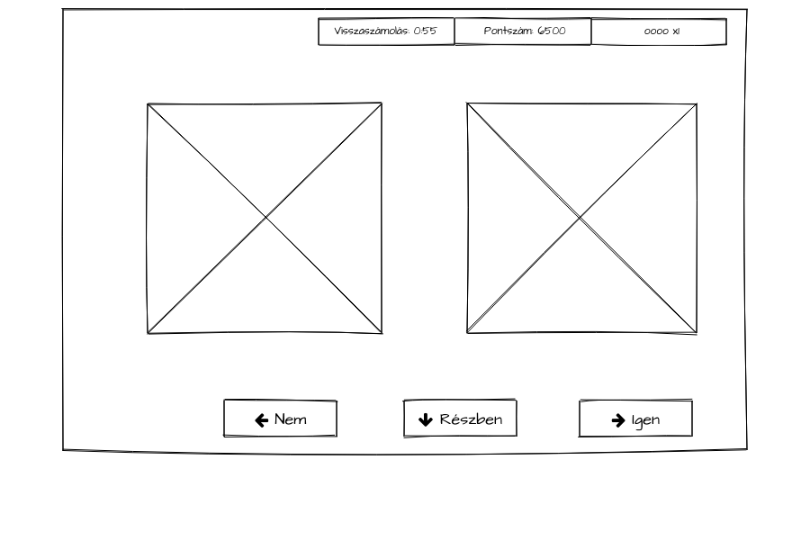

# Egyszerű játék XAML alapokon

A játék egy egyszerű desktop alkalmazás (fontos döntés!) ami méri és így segít fejleszteni a reakcióidőnket. A játék lényege, hogy kártyákat mutatunk egymás után, és minden alkalommal el kell dönteni, hogy az adott kártya egyforma-e az előzővel.

Mivel az egyes reakióidők és a játékidő hosszának mérése fontos, ezért adja magát a számítógépes megvalósítás.

## Szereplők
- Tudom Ányos

  A szellemi képességeinek  növekedését kívánja nyomon követni.

## Forgatókönyvek
### Játék (A felhasználó szemszögéből)

Ányos elindítja az alkalmazást (fontos döntés), majd, ha lefkészült, akkor elindítja a játékot. A végén a játék kijelzi az eredmént.

Mivel rövid reakcióidőt mérünk, ezért az alkalmazás indításánk idejére nem használhatjuk a játékot. Ezért az alkalmazás indítása és a játék indítása között különbséget kell tenni.

Hány képernyő legyen?
Egy és három között
- alkalmazás induló képrnyő
- játék képernyő
- eredmény kijelzés

Kezdetben indulhatunk úgy, hogy a játék kezdőképernyője egyben az alkalmazás kezdőképernyője.

Fontos, hogy a lényeg a reakcióidő mérése, így nem gompokra, hanem  billenyűleütésekre tesszük a játékos reakcióit. Viszont érdemes megjeleníteni a lehetőségeket, erre jók a gombok.

Játék közben vagy eltaláljuk a helyes választ, vagy nem. Ha eltaláljuk, azt a képernyőn például zöld pipával tudjuk jelezni. Ha nem találjuk el a helyes választ, akkor lehet piros kereszt, vagy az előző kártyalap megmutatásával a felhasználónak jelezni lehet a hibás választ.

### A játék menete részletesen (a programozó szemszögéből)

Elindul a játék
  - A kezdőképernyőn nincs semmilyen felfordított kártya.
  - Megmutatjuk az első kártyát

Fontos, hogy egymás után következhessen két egyforma kártya. Ez csak akkor lehetséges, ha vannak egyforma kártyák a pakliban. Vagy minden húzás után visszatesszük a kártyát és újra megkeverjük, vagy a pakliban eleve több egyforma kártya van.

A programozáshoz válasszunk egy könnyen áttekinthető lépéssorozatot: minden lépés után keverjük újra az egész paklit. Már csak azt kell eldönteni, hogy mekkora legyen a kártyapakli. Minél nagyobb a kártyapakli, annál valószínűtlenebb, hogy egymás után kétszer ugyanaz a kártya legyen a legtetején a paklinak.

Tehát egy értelmes kártyapakli méretet kell választanunk, legyen 6 kezdetben, azonban azt vegyük észre, hogy ez a szám, ez nem biztos, hogy megfelel egy élvezetes játéknak. Így már most érdemes rögzíteni, hogy később ez a szám változhat.
    
   - Minden alkalommal megkeverjük a kártyát és vesszük a felső lapot 
   - Minden alkalommal kivesszük véletlenszerűen az egyik lapot, majd visszatesszük 
   - dobunk egy dobókockával, és amelyik számot dobtuk azt a számú kártyát választjuk.  

Ez a három ugyanazt eredményezi, de programozni az utolsót a legegyszerűbb.

ilyenkor még nem várunk visszajelzést
  - Megmutatjuk a következő kártyát

Ugyanúgy, mint az első kártyánál
   - Várunk a felhasználó visszajelzésére 
      - első lépésben gombokon keresztül 
      - második lépésben a billentyűzetről   
   - Vagy lejár az idő 
   - Ha a felhasználó reagált, értékeljük a visszajelzést 
      - Jó/nem jó 
      - Mennyi volt a reakcióidő   
   - Az értékelést megjelenítjük 
      - jó/nem jó 
      - pontszám frissítése (hogy számoljuk a pontokat?)     
 - Ezt ismételjük, amíg le nem jár az idő
    - a hátralévő időt folyamatosan kijelezzük (mennyi a játékidő?)   
### Pontszámítás, reakcióidő mérése
  - A reakcióidőt, azt az új kártya megjelenításátől számolva kell érteni, ezredmásodpercekben mérve.
  - Mivel a játékban sok kártya felismerés lesz, ezért a reakcióidők átlagát fogjuk számolni.
  - Helyes válasz esetén hozzáadunk a ponthoz, helytelen válasz esetén vonjunk le a pontszámból.
  - a pontszám kapcsolódjon a reakcióidőhöz: ha jó a válasz, akkor minél gyorsabb volt a reakciónk annál jobb, ha rossz a válasz, akkor a levonandó pont legyen annál nagyobb, minél többet vártunk.
  - a játék tartson nyilván top 5 játékot
  - a játék jelenítse meg a top 5 listát
  - A játék végén frissítse a top 5 listát
  - Frissítéskor a top 5 listát mentsük el
  - Az alkalmazás indításakor töltse be a top 5 listánkat
  - Az eredményjelző "ugrálását" megszüntetni
  - az első kártyát azt automatikusan jelenítsük meg
  - a játék kezdete után új kártya gomb nem kell
  - a játék végével viszont kell egy új játék gomb, és a játék gombokat le kell tiltani
  - és ha az új játék gombot megnyomjuk, akkor kezdődik minden elölről
### Továbbfejlesztési ötletek
  - ahány gomb látszik a képernyőn, annyi legyen szétosztva a rendelkezésre álló helyre 
### Hibajavítások/apróbb módosítások
  - legyen az ablaknak egy minimális mérete
  - fogadjunk el a billentyűzetről is visszajelzést
  - adjunk segítséget a képernyőn, hogy milyen billentyűkkel lehet a játékot játszani.
  - a visszajelző ábrának a méretét és a színét kicsit javítsuk
  - A billentyűk csak akkor éljenek, ha már a játék elindult
  - a kód tisztítása
  - a játék érzésének javítása (két egyforma kártya esetén ez valahogy jelenjen meg)
  - visszaszámlálás
  - pontszámok számítása
### Desktop felület programozása
  - többszálú programozás

                       +----------+
                       |          |
                       | Robot 2  |
                       |          |
                       |          |
                       +----------+

+----------+                ^                          +-----------+
|          |                |                          |           |
|Robot 1   |+---------+     |       +-----------------+| Robot 3   |
|          |          |     |       |                  |           |
|          |          |     |       |                  |           |
+----------+          |     |       |                  +-----------+

                       +-----------+
                       |           |
                       |           |
                       | Áramforrás|
                       |           |
                       |           |
                       +-----------+

Egyszerre mindig csak egy kap áramot, de mivel nagyon gyorsan váltunk az egyes robotok között, olyan mint a fényképekből létrejövő mozgókép.

